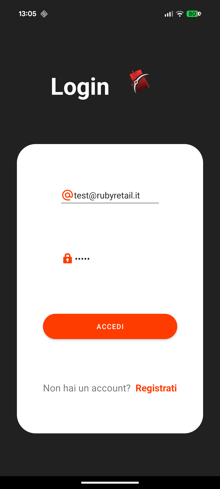
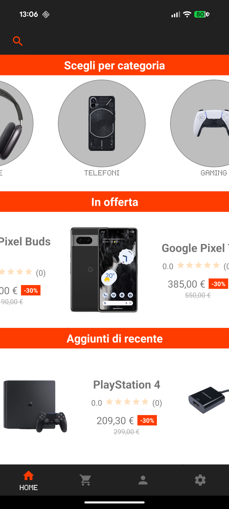
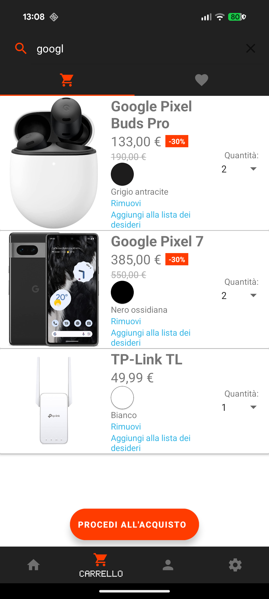
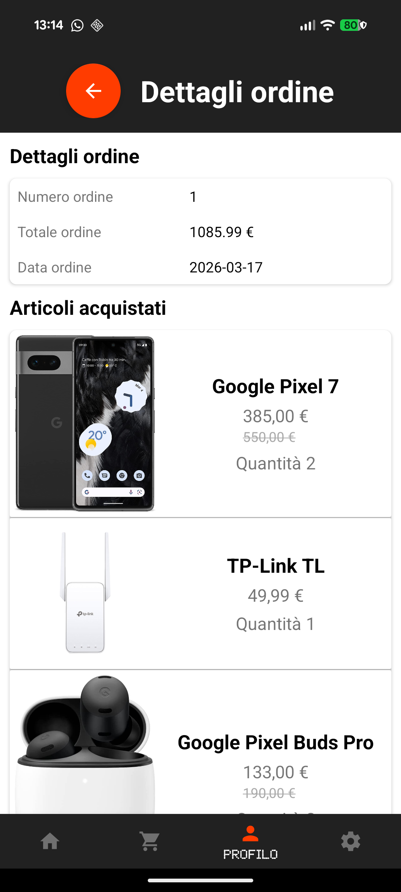

# RubyRetail

An Android e-commerce app built for the **Programmazione Web e Mobile** course (BEng Computer Engineering, University of Palermo, 2023). Users can browse products by category or search, manage a cart and wishlist, save delivery addresses and payment cards, place orders, and leave reviews on purchased products.

## Screenshots

<p float="left">
  
  
  
  
  
</p>

## Tech Stack

| Layer | Technology |
|---|---|
| Mobile | Android (Kotlin), ViewBinding, Material Design 3 |
| Networking | Retrofit2 + OkHttp |
| Backend | Python 3.11 / Django 4.2 |
| Database | MySQL 8.0 |
| Infrastructure | Docker |

## Features

- **Auth** — register and login with hashed passwords
- **Home** — category browser, active sales with discount badges, new arrivals
- **Search** — full-text product search with category filter chips and sort options (price, rating, date)
- **Product detail** — image gallery, colour selector, stock-aware quantity picker, customer ratings
- **Cart** — add/remove items, adjust quantity via spinner, discounted prices with strikethrough originals
- **Wishlist** — save items for later, move to cart in one tap
- **Checkout** — saved address and payment card selection, order total preview
- **Order history** — full order list with per-item price paid and original price
- **Reviews** — submit a star rating and comment on any product you have purchased

## Project Structure

```
RubyRetail/
├── app/src/main/java/…/
│   ├── Activities/         # MainActivity, LoginRegisterActivity, BuyActivity
│   ├── Adapters/           # RecyclerView adapters
│   ├── Fragments/          # All UI screens
│   └── Objects/            # Data classes (Product, OrderItem, …)
└── server/
    ├── docker-compose.yml
    ├── Dockerfile
    ├── database/
    │   ├── 01_schema.sql   # Full DB schema
    │   └── 02_seed.sql     # Sample products, categories, images
    └── serverdj/           # Django project + API endpoints
```

## Running Locally

**Requirements:** [Docker Desktop](https://www.docker.com/products/docker-desktop/) (Windows/macOS/Linux) and an Android device or emulator (API 26+).

> **macOS without Docker Desktop:** you can use [Colima](https://github.com/abiosoft/colima) (`brew install colima && colima start`) as a lightweight alternative to start the Docker daemon.

### 1. Start the server

```bash
cd server
docker compose up --build
```

The API will be available at `http://localhost:8000/webmobile/`.

To wipe all data and start fresh:
```bash
docker compose down -v && docker compose up --build
```

### 2. Configure the app

Open `local.properties` in the project root and set `server.baseUrl`:

| Scenario | Value |
|---|---|
| Physical device (USB/Wi-Fi) | `http://<your-Mac-LAN-IP>:8000/webmobile/` — find it with `ipconfig getifaddr en0`. Device and Mac must be on the same Wi-Fi. |
| Android Studio emulator | `http://10.0.2.2:8000/webmobile/` — this is the fixed alias the emulator uses to reach the host machine. |

### 3. Build and install

**Recommended — Android Studio:**
Open the project in [Android Studio](https://developer.android.com/studio), connect your device or start an emulator, and press Run. Android Studio handles the SDK, Java, and `adb` automatically.

**Command line (macOS/Linux, no Android Studio):**

Install the required tools:
```bash
brew install --cask temurin@21          # Java 21
brew install --cask android-commandlinetools
```

Set up the Android SDK (accept all licences, then download the required components):
```bash
export ANDROID_HOME=/opt/homebrew/share/android-commandlinetools
yes | sdkmanager --licenses
sdkmanager "platform-tools" "platforms;android-33" "build-tools;33.0.0"
```

Build and install:
```bash
export PATH="$ANDROID_HOME/platform-tools:$PATH"
./gradlew installDebug
```

Connect your device via USB with USB debugging enabled before running `installDebug`.

## Database Schema

`categories` · `products` · `product_colors` · `product_pictures` · `sales` · `users` · `user_addresses` · `user_payments` · `cart_items` · `wishlist_items` · `orders` · `order_items` · `product_reviews`
